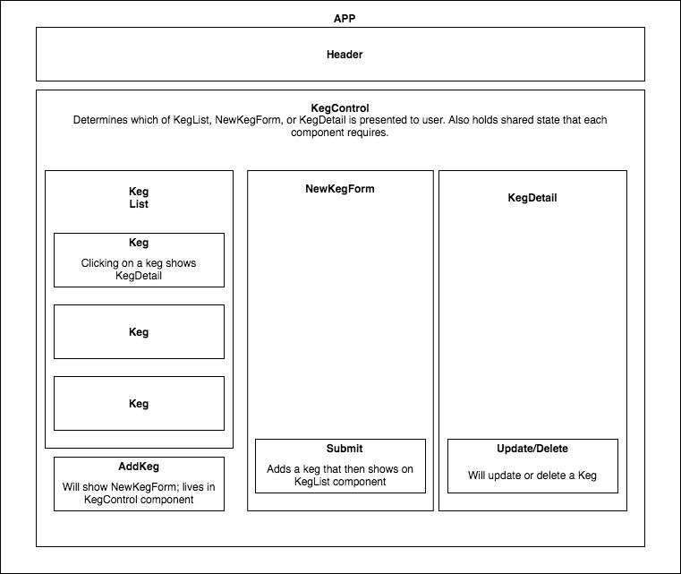

# **Growlers Taproom Keg List**

#### Author: **Daniel Merys**
#### July 3, 2020

### Description

_This application serves as an introduction to React with create-react-app, components, JSX, and props while building a site with CRUD functionality. The taproom site will display available kegs with their name, description, and number of pints remaining. A form is available to add new kegs. Quantities can be updated with a "pour" button._

### Instructions for use:

1. Open Terminal (macOS) or PowerShell (Windows)
2. To download the project Directory to your desktop enter the following commands:
```
cd Desktop
git clone https://github.com/dkmerys/tap-room.git
cd merch-site
```
3. To view the downloaded files, open them in a text editor or IDE of your choice.
* if you have VSCode for example, when your terminal is within the main project Directory you can open all of the files with the command:
```
code .
```
4. Download node and node package manager if they are not already installed on your device. You can find further instructions [here](https://www.learnhowtoprogram.com/intermediate-javascript/getting-started-with-javascript-8d3b52cf-3755-481d-80c5-46f1d3a8ffeb/installing-node-js-14f2721a-61e0-44b3-af1f-73f17348c8f4).
5. Run npm install in your terminal to download the necessary dependencies, plugins, and modules.
```
npm install
```
6. The command npm run start will build and open the compiled code in a browser of your choice using a local host.
```
npm run start
```

### Known Bugs

No bugs have been identified at the time of this update.

### Support and Contact Information

Please contact me with any suggestions or questions at dkmerys@gmail.com. Thank you for your input!  
_Have a bug or an issue with this application? [Open a new issue](https://github.com/dkmerys/tap-room/issues) here on GitHub._

### Technologies Used

* JavaScript
* React
* JSX
* HTML
* Git and GitHub

### Specs
| Spec | Input | Output |
| :------------- | :------------- | :------------- |
| **User can view hard coded kegs on static site** | User Input:"localhost:3000" | Output: “KegList is displayed" |
| **User can access a NewKegForm** | User Input:"Add keg" | Output: “NewKegForm displayed" |
| **User can add kegs to the store via a form** | User Input:"name: Boneyard RPM, description: Hop-forward, medium malt character quantity: 124, Click: Add keg" | Output: “KegList: Boneyard RPM" |
| **User can decrement Keg quantity with 'pour"** | User Input:"Boneyard RPM Stock: 124, Click: Pour" | Output: “Boneyard RPM Pints Remaining: 123" |
| **User cannot reduce a quantity below 0 when it it "out of stock** | User Input:"Boneyard RPM: "Empty Keg", Click: Pour" | Output: “Sorry, this Keg is not empty!" |




#### License

This software is licensed under the MIT license.

Copyright © 2020 **_Daniel Merys_**
